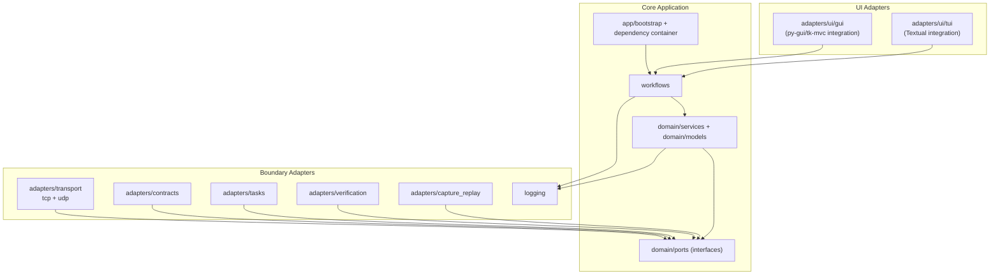

# Component Diagram

This document defines the high-level internal component layout and dependency directions.

## Component View (Mermaid)

## Dependency Rules

1. `domain/*` depends only on `domain/ports/*` abstractions.
2. `adapters/*` implement port interfaces and depend on external frameworks/protocols.
3. `adapters/ui/*` and `adapters/transport/*` are grouped under `adapters/` by architectural role.
4. `workflows/*` orchestrate use cases and are the preferred entry point for UI adapters.
5. No direct dependency from domain to GUI/TUI/framework/network implementation code.

## Requirement Mapping

- GR-021, GR-026, GR-031, GR-038, GR-058
