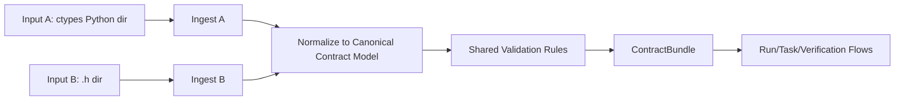

# Contract Mapping Specification (`.h` -> Runtime ContractBundle)

This document defines how contract inputs are ingested and mapped into the runtime `ContractBundle`.

## 1) Supported Input Types

The contract subsystem supports two input forms:

### Input A: Generated Python ctypes directory

- Directory of Python files generated from `.h`
- Files define collections of:
  - `ctypes.Structure` (complex structs)
  - enums/constants

### Input B: Raw `.h` directory

- Directory containing C header files
- Parsed by the contract parser pipeline

## 2) Supported Source Origins

Both input types (A and B) can originate from:

1. **Local source**
   - local filesystem directory path
2. **Remote source**
   - repository URL + pinned ref/commit/tag
   - materialized into a local snapshot before ingestion

## 3) Canonical Pipeline (Unified After Entry)

Different entry points are allowed, but all inputs must pass through one shared pipeline after ingestion.

## 4) Entry Behavior by Input Type

### 4.1 Input A (ctypes Python dir)

1. Load directory metadata.
2. Read allowed contract declarations (struct/enum symbols).
3. Convert to canonical model objects.
4. Preserve source metadata (`origin`, `source_type=A`, `snapshot_ref`, `generator_version` if available).

### 4.2 Input B (`.h` dir)

1. Parse headers via `.h` parser.
2. Build struct/enum canonical model objects.
3. Preserve source metadata (`origin`, `source_type=B`, `snapshot_ref`, parser version).

## 5) Canonical Model Requirements

Both inputs normalize to one internal shape:

- `ContractBundle`
  - bundle ID + version hash
  - symbol table (types/enums/constants)
  - field/type metadata
  - source provenance list

## 6) Shared Validation Rules

Validation is identical regardless of source type:

1. Unknown/unsupported field types are rejected.
2. Duplicate symbol names with conflicting signatures are rejected.
3. Struct field ordering/size metadata must be internally consistent.
4. Enum naming/value collisions are rejected.
5. Validation failures return deterministic error codes/messages.

## 7) Conflict Policy (A + B Together)

If both A and B are provided in the same load operation:

- Merge is attempted by symbol name.
- If symbol definitions are equivalent -> keep one canonical symbol with both provenance entries.
- If symbol definitions conflict -> **fail the load operation** (no partial bundle update).

This avoids silent precedence bugs.

## 8) Security and Trust Rules

1. Remote inputs must be pinned to explicit commit/ref before use.
2. Source provenance must be recorded in bundle metadata.
3. Input A loaders must limit accepted declaration patterns (struct/enum contract data only).
4. No runtime contract mutation after bundle validation.

## 9) Why Dual Entry + Shared Pipeline is Preferred

- Allows teams to use pre-generated artifacts (A) or source headers (B).
- Keeps one validation behavior and one runtime model (`ContractBundle`).
- Reduces drift and duplicated rule logic.

## 10) Requirement Mapping

- GR-009, GR-022, GR-023
