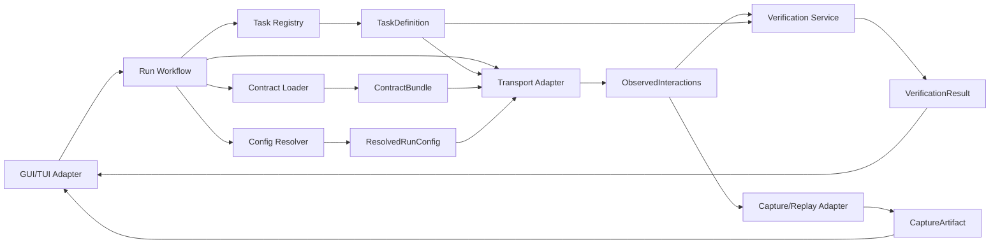

# Data Model and Data Flow Overview (MVP)

This document summarizes core runtime data objects and how they flow across architecture boundaries.

## 1) Core Data Objects

- `ContractBundle`: normalized validated type definitions from `.h` and/or generated `ctypes`
- `TaskDefinition`: validated executable scenario definition
- `ResolvedRunConfig`: immutable merged runtime configuration snapshot
- `MessageEnvelope`: canonical message unit for send/receive processing
- `ObservedInteractions`: ordered transport observations
- `VerificationResult`: deterministic pass/fail and mismatch output
- `CaptureArtifact`: file-based capture output for replay

## 2) High-Level Data Flow

## 3) Data Integrity Rules

1. `ResolvedRunConfig` is immutable during run execution.
2. `ContractBundle` must be validated before task execution starts.
3. `TaskDefinition` must be normalized and validated before registration.
4. `ObservedInteractions` ordering is preserved as observed by transport adapter.
5. `VerificationResult` is deterministic for identical expected/observed inputs.

## 4) Boundary Ownership

- Domain/services own business semantics for run orchestration and verification.
- Adapters own translation to external systems (UI, transport, files, framework APIs).
- Ports define interface contracts to keep data flow stable and testable.

## 5) Requirement Mapping

- GR-044, GR-022, GR-023, GR-030, GR-031
