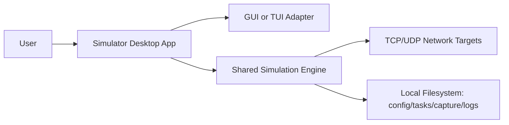

# Deployment Topology and Environment Strategy (MVP)

This document defines deployment topology and environment strategy for the desktop simulator.

## 1) Topology Summary

MVP is a single-process desktop application with optional network interactions.

## 2) Runtime Modes

1. GUI mode (Tkinter MVC via `py-gui` submodule)
2. TUI mode (Textual)

Both modes run against the same in-process core services and adapter contracts.

## 3) Environment Strategy

### 3.1 Supported Platforms (MVP)

- Windows
- Linux

### 3.2 Runtime Prerequisites

- Supported Python version range defined in runtime config model
- Required Python dependencies installed
- For GUI mode: Tkinter runtime availability
- For TUI mode: terminal capabilities for Textual

### 3.3 Configuration Strategy

- Environment-independent defaults in project config
- Target-specific network settings in target config
- Run-time overrides resolved per run into immutable snapshot

## 4) Artifact Locations (Logical)

- Contracts: repo/user-provided directories
- Tasks: built-in and runtime `.task.json` files
- Captures: local capture output directory
- Logs: console and optional rotating local log files

## 5) Network Topology Behavior

1. Client mode: simulator initiates connection/send to configured target endpoint.
2. Server mode: simulator binds/listens on configured local endpoint.
3. Transport behavior and timeout/retry semantics are defined in `architecture/transport-spec.md`.

## 6) Security and Operational Considerations

1. Use pinned refs for remote contract materialization.
2. Do not store secrets in plaintext config or logs.
3. Validate compatibility and config before run start.
4. Fail fast on unsupported environments.

## 7) Failure and Recovery Expectations

1. Startup failure if environment compatibility check fails.
2. Run failure with deterministic error code on invalid config/task/contract.
3. Capture/log path errors must produce actionable diagnostics.

## 8) Requirement Mapping

- GR-044, GR-045, GR-011, GR-012, GR-031
