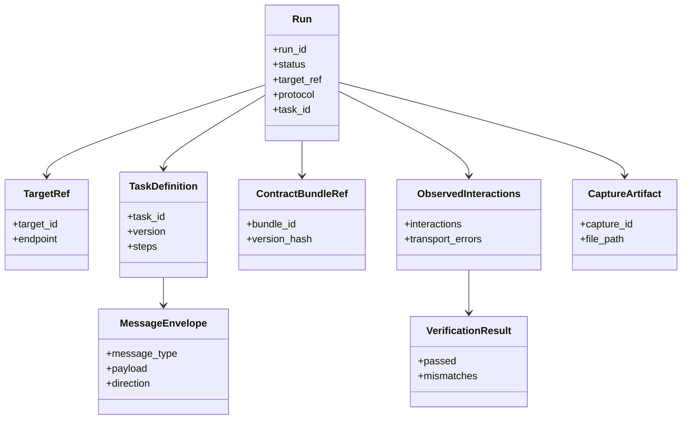

# Domain Model (MVP)

This document defines the core domain entities and lifecycle/state boundaries.

## 1) Core Entities

### Run
- **Purpose:** Represents one simulation execution attempt.
- **Key fields:** `run_id`, `target_ref`, `protocol`, `task_id`, `status`, `started_at`, `ended_at`.
- **State:** `created -> running -> completed|failed|cancelled`.

### TargetRef
- **Purpose:** Identifies the target application/system under simulation.
- **Key fields:** `target_id`, `name`, `endpoint`, `protocol_options`.

### ContractBundleRef
- **Purpose:** Points to loaded contract definitions used in the run.
- **Key fields:** `bundle_id`, `source_paths`, `version_hash`.

### TaskDefinition
- **Purpose:** Defines executable simulation behavior.
- **Key fields:** `task_id`, `version`, `steps`, `preconditions`, `metadata`.

### MessageEnvelope
- **Purpose:** Runtime message unit validated/executed during a run.
- **Key fields:** `message_type`, `direction`, `payload`, `headers`, `correlation_ids`.

### ObservedInteractions
- **Purpose:** Ordered runtime observations from transport execution.
- **Key fields:** `interactions`, `transport_errors`, `timestamps`.

### VerificationResult
- **Purpose:** Result of expected-vs-observed evaluation.
- **Key fields:** `passed`, `summary`, `mismatches`, `rule_results`.

### CaptureArtifact
- **Purpose:** File-based capture/replay artifact.
- **Key fields:** `capture_id`, `file_path`, `metadata`, `created_at`.

## 2) Lifecycle and State Notes

1. **Stateless boundary (GR-021):**
   - Domain services do not persist mutable per-session/per-target execution state in process between runs.
   - Run-specific state exists only within a run transaction/context and in explicit artifacts/logs.

2. **Task lifecycle:**
   - `parsed -> validated -> registered -> executable`
   - On validation/register failure, no partial registration state remains.

3. **Verification lifecycle (MVP):**
   - collect observed interactions
   - evaluate count-based rules
   - emit deterministic pass/fail output

4. **Capture/replay lifecycle:**
   - capture run writes artifact file + metadata
   - replay reads artifact and executes ordered interactions

## 3) Domain Relationships (Mermaid)

## 4) Requirement Mapping

- GR-021, GR-023, GR-030
