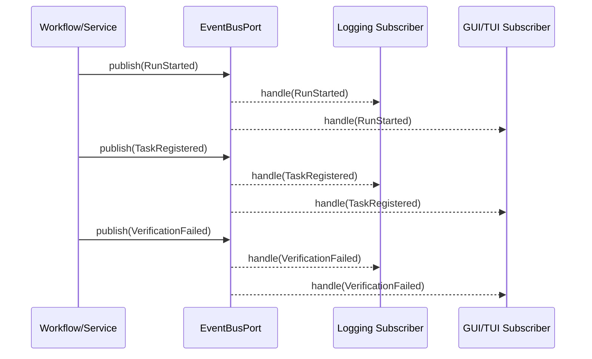

# Event Model and Event Manager Plan

This document defines event types, publish/subscribe points, and event manager placement.

## 1) Event Manager Placement

### Contract Location
- `domain/ports/event_bus.py` (port interface)

### Event Types Location
- `domain/events/*` (event payload definitions)

### Default Implementation
- `app/events/in_memory_event_bus.py` (desktop in-process event manager)

### Optional Future Implementations
- `adapters/events/*` (external brokers if later required)

## 2) Event Types (Initial Set)

### Run Lifecycle Events
- `RunStarted`
- `RunCompleted`
- `RunFailed`
- `RunCancelled`

### Task Lifecycle Events
- `TaskLoadRequested`
- `TaskLoaded`
- `TaskValidationFailed`
- `TaskRegistered`

### Verification Events
- `VerificationStarted`
- `VerificationPassed`
- `VerificationFailed`

### Capture/Replay Events
- `CaptureWritten`
- `ReplayStarted`
- `ReplayCompleted`

## 3) Event Payload Shape (Broad)

Each event SHOULD include:
- `event_id`
- `event_type`
- `timestamp`
- `run_id` (when applicable)
- `task_id` (when applicable)
- `target_id` (when applicable)
- `metadata` (safe, redacted where needed)

## 4) Publish/Subscribe Points

### Publishers
- Run workflow/service
- Task loading workflow
- Verification service
- Capture/replay workflow

### Subscribers (examples)
- Logging subsystem
- UI notification/update handlers (GUI/TUI adapters)
- Metrics/diagnostic collectors (future)

## 5) Event Flow (Mermaid)

## 6) Event Manager Rules

1. Domain/workflows publish events via `EventBusPort`, not concrete implementations.
2. Event handlers must be idempotent or tolerant to repeated events where possible.
3. Sensitive data must be redacted before publishing/logging.
4. Event dispatch failures must not corrupt core run state.
5. Event bus implementation choice must preserve UI responsiveness (non-blocking dispatch strategy as needed).
6. Transport I/O and protocol waits SHALL execute off the UI thread (Tkinter main loop / Textual app loop).
7. Any subscriber that mutates UI state SHALL marshal that update onto the owning UI thread/event loop.
8. The default in-process bus SHOULD support queued/asynchronous dispatch across threads to avoid deadlocks and long publisher stalls.

## 7) Requirement Mapping

- GR-058, GR-059
