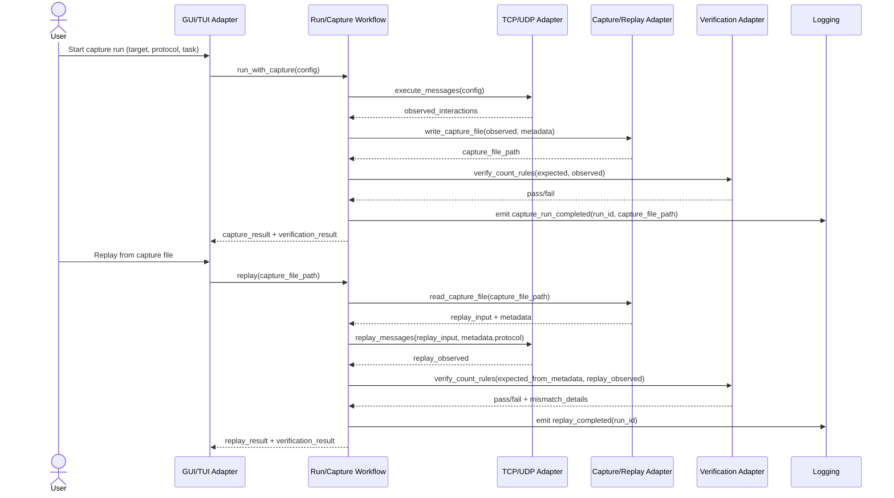

# Sequence Diagram: File-Based Capture and Replay

This document describes file-based traffic capture and replay in MVP.

## Sequence (Mermaid)

## Determinism Assumptions (MVP)

1. Capture artifacts persist as files and include replay-critical metadata:
   - protocol
   - target identifier
   - task/version context
   - timestamp/run ID
2. Replay uses the same message order from capture input.
3. For deterministic comparison, expected verification rules are loaded from capture metadata or run config.
4. Non-deterministic external effects are out of scope for MVP and should be documented per feature.

## Requirement Mapping

- GR-029, GR-030, GR-031, GR-059

## Related Artifact

- `architecture/capture-schema-versioning.md`
