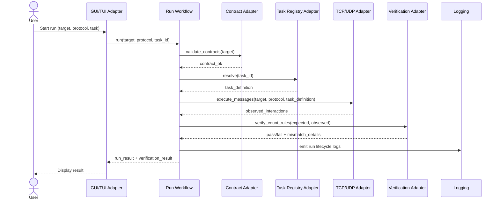

# Sequence Diagram: Happy Path Run

This document describes the primary run path from user action to verification result.

## Sequence (Mermaid)

## Happy Path Notes

1. UI layer only forwards user intent and displays outputs.
2. Workflow orchestrates services/adapters.
3. Contracts and tasks are validated/resolved before transport execution.
4. Verification in MVP is count-based.
5. Logs are emitted with correlation identifiers and redaction.

## Requirement Mapping

- GR-019, GR-020, GR-022, GR-023, GR-026, GR-030, GR-031, GR-059
