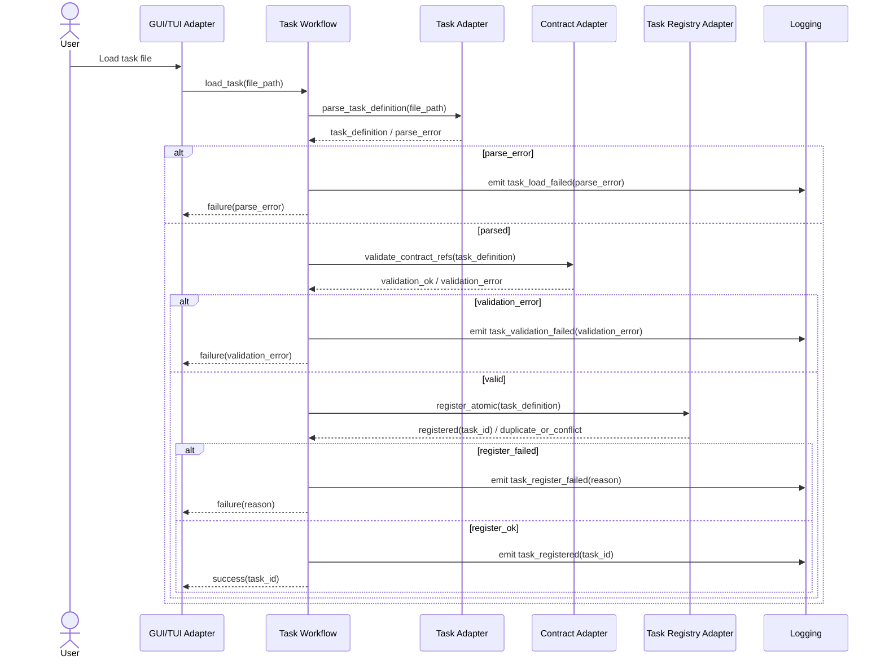

# Sequence Diagram: Runtime Task Load / Register

This document describes the task-loading flow from user action to validated registration.

## Sequence (Mermaid)

## Validation and Atomicity Notes

1. Registration MUST occur only after parse + contract validation succeed.
2. Registration is atomic per task file (no partial mutation on failure).
3. Duplicate/conflicting task IDs are rejected with deterministic error output.
4. Success response includes stable task identifier for subsequent execution.

## Requirement Mapping

- GR-023, GR-027, GR-028, GR-022, GR-059
